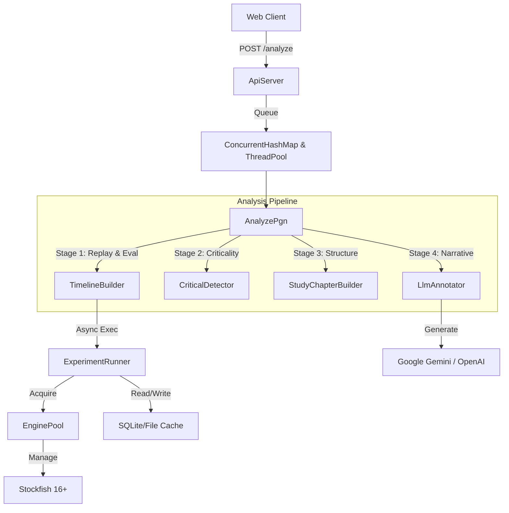

# System Architecture: Condensed Chess

## 1. High-Level Overview

Condensed Chess is a **data-driven chess analysis pipeline** that transforms raw game records (PGN) into rich, narrative-driven "books". It uses a multi-stage process involving engine evaluation, structural analysis, and LLM-based narrative generation.

### Core Philosophy
- **"Book Metaphor"**: Analysis is preserved as a structured Book with Chapters, not just a list of moves.
- **"Hypothesis Testing"**: We don't just ask Stockfish "what is best?". We ask "Is this a tactical position?" or "Is the King safe?".
- **"Golden Standard"**: Regression testing ensures analytical stability.

---

## 2. Component Architecture

### 2.1 Backend (Scala 3)
The core logic resides in a storage-agnostic Scala application.

#### Key Components:
- **`ApiServer`**: Lightweight HTTP wrapper (Java `httpserver`). Handles routing, job queuing, and status monitoring (`/status`).
- **`EnginePool`**: Manages a fixed set of Stockfish instances (limit = CPU cores). Prevents resource exhaustion.
- **`ExperimentRunner`**: The "Scientist". Formulates hypotheses (e.g., "Is this a fortress?") and runs targeted engine tasks. Handles caching to avoid re-computing common positions.
- **`TimelineBuilder`**: Converts raw moves into a `Timeline` enriched with features, evaluations, and tags.
- **`BookBuilder`**: Transforms the timeline into a `Book` object with `OpeningPortrait`, `MiddleGame`, and `Endgame` sections.

### 2.2 Frontend (Next.js 14)
A modern React application for consuming and visualizing the analysis.

- **`StudyShell`**: Main layout managing the "Study" context.
- **`ReadingMode`**: Prose-focused view (like a book).
- **`ReviewBoard`**: Interactive board with `chessground`.
- **`CoachOverlay`**: visual layers for concepts (arrows, circles).

---

## 3. The Analysis Pipeline (4 Stages)

### Stage 1: Assessment (The "Eye")
- **Input**: PGN
- **Action**: 
    1. **Replay**: Validate moves.
    2. **Opening Lookup**: Identify opening name and book depth.
    3. **Deep Evaluation**: Run Stockfish on every move (Depth 14-18).
    4. **Feature Extraction**: Calculate static features (Pawn Structure, King Safety).
- **Output**: `Timeline` (Raw Data)

### Stage 2: Investigation (The "Scientist")
- **Input**: `Timeline`
- **Action**: 
    1. **Critical Detection**: Identify "turning points" where win probability swings.
    2. **Branching**: For critical errors, explore "What if?" variations.
    3. **Concept Tagging**: Apply labels like `TacticalMiss`, `GoodSacrifice` based on delta-eval.
- **Output**: `CriticalNodes`, `Variations`

### Stage 3: Editorial (The "Author")
- **Input**: `Timeline` + `CriticalNodes`
- **Action**: 
    1. **Chaptering**: Divide game into logical phases.
    2. **Selection**: Decide which variations to show and which to hide.
    3. **Drafting**: Generate "prompt context" for the LLM.
- **Output**: `StudyBook` (Draft)

### Stage 4: Publication (The "Narrator")
- **Input**: `StudyBook` (Draft)
- **Action**: 
    1. **LLM Generation**: Send structured prompts to LLM.
    2. **Annotation**: Fill `comment` fields in the StudyBook.
- **Output**: `Final JSON`

---

## 4. Reliability & Observability

### 4.1 Concurrency Control
- **Semaphore**: `EnginePool` limits active engine processes.
- **Job Queue**: `ApiServer` queues incoming requests. 

### 4.2 Caching
- **Eval Cache**: Hash-based cache (SQLite/File) for engine inputs. Prevents re-analyzing the same position.

### 4.3 Monitoring
- **`/status` Endpoint**: Exposes active job count, cache hits, and pool utilization (Localhost only).
- **Structured Logs**: Logback (SLF4J) for machine-readable logs.

### 4.4 Testing
- **Golden Master**: `GoldenAnalysisTest` ensures output stability by comparing against blessed JSON artifacts.
