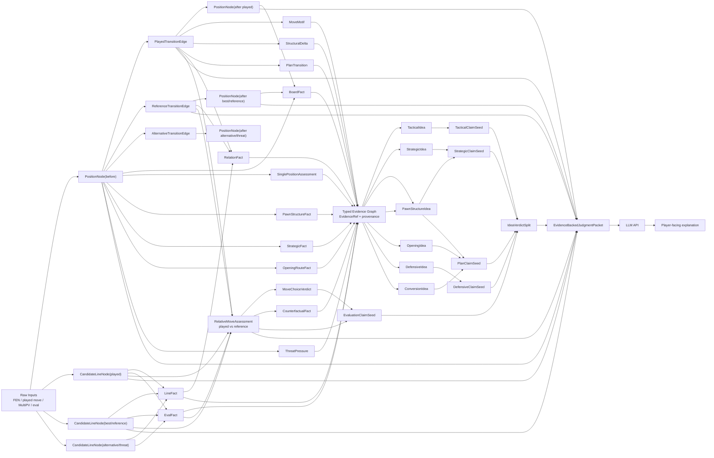

# 분석기 역할 지도

체스 판단 코어는 해설 문장을 만들지 않는다. 목표 산출물은 LLM이 해설을 쓸 수 있을 만큼 정확한 typed judgment packet이다.

2단계에서 채울 가상 모듈과 기존 분석 자산의 상호작용은 `JudgmentInteractionMap.md`를 기준으로 본다.

## 최종 판단 그래프

## 역할 경계

- `analysis.position`: FEN과 보드에서 직접 검증되는 BoardFact와 `PositionFeatures`를 만든다.
- `analysis.singlePosition`: 하나의 position node에 대한 성격, 후보군 위상, 위협 압력, 폰 플레이를 판단한다. blunder, mistake 같은 수의 상대평가는 만들지 않는다.
- `analysis.line`: PV, legal replay, forced branch, mate branch처럼 라인 자체의 사실을 만든다.
- `analysis.evaluation`: white-POV eval을 mover-relative 값으로 바꾸고 공통 판단 임계값을 제공한다.
- `analysis.tactical`: pin, fork, overload, deflection, defender removal 같은 관계 사실과 전술 claim seed를 만든다.
- `analysis.structure`: pawn structure, weak target, structural delta, plan alignment 같은 구조 사실을 만든다.
- `analysis.strategic`: outpost, space, counterplay restraint, endgame pattern 같은 전략 feature를 만든다.
- `analysis.plan`: 여러 node fact, line fact, threat, structure, strategic feature를 조합해 plan pressure와 active plans를 만든다.
- `analysis.transition`: 한 position node에서 다음 node로 넘어가는 move edge와 plan transition을 판단한다.
- `analysis.move`: 수 중심의 기존 motif 자산을 support evidence로 제공하되, 중복 판단은 line, tactical, transition, relative assessment 쪽으로 흡수한다.
- `analysis.opening`: 오프닝 route와 route target 사실을 제공한다.
- `analysis.policy`: 특정 판단을 승격하거나 억제하는 경계 predicate를 둔다.
- `model.judgment`: position node, line node, transition edge, relative assessment, evidence ref, LLM judgment packet을 정의한다.
- `model.strategic`: plan taxonomy, strategic state, plan continuity 같은 전략 모델을 정의한다.

## 상호작용 순서

1. `analysis.position`과 `analysis.singlePosition`이 단일 노드 사실을 만든다.
2. `analysis.line`과 `analysis.evaluation`이 candidate line과 engine comparison 입력을 만든다.
3. `analysis.transition`이 played move의 node-to-node edge를 만든다.
4. `analysis.tactical`, `analysis.structure`, `analysis.strategic`, `analysis.plan`이 evidence ref를 공유하며 claim seed를 만든다.
5. `model.judgment.RelativeMoveAssessment`가 played line과 reference line을 비교해 수의 verdict를 만든다.
6. `model.judgment.LlmJudgmentPacket`이 node, edge, evidence, claim, verdict를 묶어 LLM에 넘긴다.

## 1.5 조립 요소

- `PositionFactNormalizer`: board fact와 position feature를 `BoardFactEvidence`로 등록한다.
- `SinglePositionFactNormalizer`: 단일 포지션 판단을 `SinglePositionEvidence`로 등록한다.
- `LineFactNormalizer`: PV, legal replay, reply, continuation을 `LineFactEvidence`로 등록한다.
- `EvalFactNormalizer`: candidate line의 eval, mate, depth를 `EvalFactEvidence`로 등록한다.
- `MoveMotifNormalizer`: `MoveAnalyzer`의 수 중심 motif를 `MoveMotifEvidence`로 등록한다.
- `RelationFactNormalizer`: relation witness를 typed `RelationFactEvidence`로 등록한다.
- `StrategicFactNormalizer`: structure, plan pressure, threat pressure, strategic tag를 evidence graph에 등록한다.
- `OpeningRouteFactNormalizer`: opening route target과 piece route를 `OpeningRouteFactEvidence`로 등록한다.
- `TransitionFactNormalizer`: structural delta, plan transition, counterfactual, relative assessment를 edge evidence로 등록한다.
- `PositionNodeBuilder`: board fact, position feature, single-position assessment를 `PositionNode`로 묶는다.
- `CandidateLineNodeBuilder`: engine PV, legal replay, depth, mate, eval을 `CandidateLineNode`로 묶는다.
- `MoveTransitionEdgeBuilder`: played/reference/alternative move를 node-to-node edge로 묶는다.
- `RelativeMoveAssessmentBuilder`: played transition과 reference line을 비교해 수의 상대평가를 만든다.
- `ChessIdeaBuilder`: 여러 evidence layer를 전술, 전략, 폰구조, 오프닝, 수비, 전환 idea로 승격한다.
- `ClaimComposer`: idea와 eval comparison을 문장 없이 `ClaimSeed`로 조합한다.
- `JudgmentAssemblyContext`: node, line, transition, relative assessment, evidence, idea, claim을 한 그래프 조립 단위로 유지한다.
- `JudgmentPacketBuilder`: 조립된 그래프를 `EvidenceBackedJudgmentPacket`으로 묶는다.
- `EvidenceLossDiagnostics`: fact 등록, idea 승격, claim 승격 중 판단이 어디에서 사라졌는지 layer별로 기록한다.

## 2단계 진입 후 채울 판단

- 전술 idea composer: relation fact, line fact, eval fact를 조합해 pin, overload, deflection, defender removal 같은 idea를 만든다.
- 전략 idea composer: structure, strategic feature, plan pressure, opening route를 조합해 장기 계획 idea를 만든다.
- 수비 idea composer: threat pressure, only-defense topology, relative assessment를 조합해 방어 필요성을 만든다.
- 평가 결합 규칙: 좋은 local idea와 나쁜 move verdict가 공존할 때 `IdeaVerdictSplit`의 관계를 더 세밀하게 판정한다.
- QC 진단 runner: `EvidenceLossDiagnostics`를 corpus 결과와 연결해 어느 layer에서 체스 판단이 손실됐는지 집계한다.
