# 판단 상호작용 지도

이 문서는 Move Review 백엔드가 문장을 쓰지 않고 LLM 입력용 체스 판단 패킷을 만들기 위해 필요한 모듈 상호작용을 정리한다. 이름이 아직 코드에 없는 항목은 2단계에서 채울 가상 모듈이다. 지도는 구현 과정에서 바뀔 수 있지만, 단일 포지션 판단과 두 노드 상대평가, idea와 verdict, evidence와 claim의 경계는 유지한다.

현재 public packet 목표는 `EvidenceBackedJudgmentPacket`/`LlmJudgmentPacket`이다. `MoveReviewJudgmentPacket` 같은 새 이름은 schema가 안정된 뒤 검토한다.

## 전체 흐름

```mermaid
flowchart LR
  RAW["RawMoveReviewInput<br/>FEN / played move / MultiPV / eval"]

  subgraph INPUT["입력 정규화"]
    MIN["MoveReviewInputNormalizer"]
    JPA["JudgmentProvenanceAllocator"]
    EPP["EvaluationPerspectivePolicy"]
    VTP["VerdictThresholdPolicy"]
  end

  subgraph EXISTING["기존 분석 자산"]
    POS["analysis.position"]
    SINGLE["analysis.singlePosition"]
    LINE["analysis.line"]
    EVAL["analysis.evaluation"]
    MOVE["analysis.move"]
    TACT["analysis.tactical"]
    STRUCT["analysis.structure"]
    STRAT["analysis.strategic"]
    PLAN["analysis.plan"]
    OPEN["analysis.opening"]
    POLICY["analysis.policy"]
  end

  subgraph INGEST["증거 등록"]
    MJO["MoveReviewJudgmentOrchestrator"]
    PN["PositionNodeAssembler"]
    LN["CandidateLineAssembler"]
    TE["TransitionEdgeAssembler"]
    NLT["NodeLineTransitionAssembler"]
    NOR["*Normalizer"]
    EGA["EvidenceGraphAssembler"]
    EPOL["EvidenceAdmissionPolicy"]
  end

  subgraph REL["상대평가"]
    RLS["ReferenceLineSelector"]
    OMD["OnlyMoveGapDetector"]
    OCB["OnlyMoveContextBinder"]
    VCA["VerdictCalibrator"]
    CCE["CandidateComparisonEdge"]
    CFC["CounterfactualComparator"]
    RCF["RelativeCauseFact"]
    RMA["RelativeAssessmentComposer"]
    MVC["MoveVerdictCertification"]
  end

  subgraph IDEA["체스 idea 합성"]
    LSC["LineSupportComposer"]
    TIC["TacticalIdeaComposer"]
    SIC["StrategicIdeaComposer"]
    PIC["PawnStructureIdeaComposer"]
    OIC["OpeningIdeaComposer"]
    PLID["PlanIdeaRepresentationPolicy"]
    DIC["DefensiveIdeaComposer"]
    CIC["ConversionIdeaComposer"]
    MIC["MaterialIdeaComposer"]
    EIC["EvaluationIdeaComposer"]
  end

  subgraph CLAIM["claim 그래프"]
    CGB["ClaimCandidateGraphBuilder"]
    TCP["TacticalClaimComposer"]
    SCP["StrategicClaimComposer"]
    PCP["PlanClaimComposer"]
    PWP["PawnStructureClaimComposer"]
    OCP["OpeningClaimComposer"]
    DCP["DefensiveClaimComposer"]
    CCP["ConversionClaimComposer"]
    MCP["MaterialClaimComposer"]
    ECP["EvaluationClaimComposer"]
    CTP["ClaimTruthPolicy"]
    CCF["ClaimConflictResolver"]
    CDA["ClaimDeduplicator"]
    CSC["ClaimSupportCluster"]
    CEC["ClaimEventCluster"]
    CAR["ClaimArbitrator"]
  end

  subgraph BIND["판정 결합"]
    IVR["IdeaVerdictReconciler"]
    IVP["IdeaVerdictBindingPolicy"]
    BIP["BadMoveIdeaPreserver"]
    VCR["VerdictContradictionResolver"]
    CSR["ClaimSalienceRanker"]
  end

  subgraph PACKET["패킷/QC"]
    JPV["JudgmentPacketValidator"]
    BRP["BranchReplyProbePlanner"]
    PRQ["ProbeRequest[]"]
    JP["EvidenceBackedJudgmentPacket"]
    ELR["ExpectedEvidenceLossPolicy"]
    ELQ["EvidenceLossQcRunner"]
    GLM["GraphLossMetricsRunner"]
    SCM["SemanticCoverageMetrics"]
    VCM["VerdictCalibrationMetrics"]
    CQA["ChessQualityAudit"]
  end

  RAW --> MIN --> MJO
  MIN --> EPP --> VTP
  MIN --> JPA

  MJO --> POS
  MJO --> SINGLE
  MJO --> LINE
  MJO --> EVAL
  MJO --> MOVE
  MJO --> TACT
  MJO --> STRUCT
  MJO --> STRAT
  MJO --> PLAN
  MJO --> OPEN

  POS --> PN
  SINGLE --> PN
  LINE --> LN
  EVAL --> LN
  STRUCT --> TE
  PLAN --> TE

  MOVE --> NOR
  TACT --> NOR
  OPEN --> NOR
  STRAT --> NOR
  POLICY --> EPOL

  PN --> NLT
  LN --> NLT
  TE --> NLT
  NLT --> NOR
  JPA --> NOR
  NOR --> EPOL --> EGA

  EGA --> RLS
  LN --> RLS
  EVAL --> VCA
  VTP --> VCA
  RLS --> OMD --> OCB
  RLS --> CCE
  RLS --> CFC
  VCA --> RMA
  CCE --> RCF
  RCF --> MVC
  OCB --> RMA
  CFC --> RMA
  MVC --> RMA

  EGA --> LSC
  LSC --> TIC
  LSC --> DIC
  LSC --> EIC
  EGA --> TIC
  EGA --> SIC
  EGA --> PIC
  EGA --> OIC
  EGA --> PLID
  EGA --> DIC
  EGA --> CIC
  EGA --> MIC
  RMA --> DIC
  RMA --> MIC
  RMA --> EIC
  RMA --> IVR

  TIC --> TCP
  SIC --> SCP
  PIC --> PWP
  PIC --> PCP
  OIC --> OCP
  OIC --> PCP
  DIC --> DCP
  CIC --> CCP
  MIC --> MCP
  EIC --> ECP
  PLID --> PCP

  TCP --> CGB
  SCP --> CGB
  PCP --> CGB
  PWP --> CGB
  OCP --> CGB
  DCP --> CGB
  CCP --> CGB
  MCP --> CGB
  ECP --> CGB
  CGB --> CTP --> CCF --> CDA --> CAR
  CAR --> CSC
  CAR --> CEC
  CSC -. support ids .-> CEC

  TIC --> IVR
  SIC --> IVR
  PIC --> IVR
  OIC --> IVR
  DIC --> IVR
  CIC --> IVR
  MIC --> IVR
  EIC --> IVR
  IVR --> IVP --> BIP --> VCR
  CAR --> CSR
  VCR --> CSR

  MJO --> PN
  MJO --> LN
  MJO --> TE
  MJO --> EGA
  MJO --> RMA
  MJO --> CGB
  MJO --> IVR
  CSR --> BRP
  BRP --> PRQ
  CSR --> JPV --> JP
  PRQ --> JP
  JP --> ELR --> ELQ --> GLM
  JP --> SCM
  JP --> VCM
  JP --> CQA
```

## 기존 모듈 배치

| 기존 모듈 | 그래프 역할 | 직접 출력 | 다음 소비자 |
|---|---|---|---|
| `analysis.position` | 보드에서 즉시 검증 가능한 단일 노드 사실 | `Fact`, `PositionFeatures` | `PositionFactNormalizer`, `PositionNodeAssembler` |
| `analysis.singlePosition` | 한 포지션의 성격, 후보군, 위협, 폰 플레이 | `SinglePositionAssessment`, `ThreatAnalysis`, `PawnPlayAnalysis` | `SinglePositionFactNormalizer`, `StrategicFactNormalizer`, `DefensiveIdeaComposer` |
| `analysis.line` | PV, legal replay, forced branch | line facts | `CandidateLineAssembler`, `LineFactNormalizer`, `ReferenceLineSelector`, `LineSupportComposer` |
| `analysis.evaluation` | eval 관점 변환, threshold | eval fact, mover-relative values | `EvalFactNormalizer`, `EvaluationPerspectivePolicy`, `VerdictCalibrator` |
| `analysis.move` | 수 중심 motif 탐지 | `Motif[]` | `MoveMotifNormalizer`, idea composers의 support evidence |
| `analysis.tactical` | relation witness와 전술 관계 | `RelationWitness` | `RelationFactNormalizer`, `TacticalIdeaComposer` |
| `analysis.structure` | pawn structure, structural delta, target profile | structure profile, transition delta | `StrategicFactNormalizer`, `TransitionFactNormalizer`, `PawnStructureIdeaComposer`, `RelativeCauseFact` |
| `analysis.strategic` | 전략 feature, endgame/oracle, practical signal | strategic facts | `StrategicFactNormalizer`, `StrategicIdeaComposer` |
| `analysis.plan` | plan pressure, active plans, plan transition | `PlanScoringResult`, `ActivePlans`, `PlanSequenceSummary` | `StrategicFactNormalizer`, `TransitionFactNormalizer`, `StrategicIdeaComposer`, `PlanClaimComposer` |
| `analysis.opening` | opening identity/recognition/prior context and opening relevance binding over generic feature anchors | `OpeningContextEvidence`, `FeatureAnchorEvidence`, `ApplicabilityAssessmentEvidence` | `OpeningContextFactNormalizer`, `OpeningIdeaComposer` |
| `analysis.policy` | 증거 승격/억제 경계 | predicates | `EvidenceAdmissionPolicy`, `ClaimTruthPolicy` |

## 증거 등록 상호작용

| 가상/기존 모듈 | 입력 | 출력 | 상호작용 |
|---|---|---|---|
| `MoveReviewInputNormalizer` | FEN, UCI, MultiPV, eval | normalized input snapshot | FEN/UCI 정규화, mover, ply, played/reference/alternative line 후보를 계산한다. |
| `EvaluationPerspectivePolicy` | white-POV eval, side to move | mover-relative eval contract | `ThreatPressureAssessor`의 side-to-move score와 `PerspectiveMath`의 white-POV 전제를 한 경계로 묶는다. |
| `VerdictThresholdPolicy` | cp loss, mate, phase, depth | threshold profile | `MoveChoiceAssessment`와 `JudgmentThresholds`의 갈라진 기준을 하나의 verdict 기준으로 통합한다. |
| `JudgmentProvenanceAllocator` | normalized input, graph refs | deterministic ids | `EvidenceRef.id`, producer, layer, scope, parent link를 일관되게 만든다. |
| `MoveReviewJudgmentOrchestrator` | normalized input | `JudgmentAssemblyContext` | 전체 조립 순서를 조율하되 체스 판단 자체는 하위 composer에 위임한다. |
| `PositionNodeAssembler` | `analysis.position`, `analysis.singlePosition` | `PositionNode(before/after/reference)` | `PositionNodeBuilder`를 사용하고 board/single evidence를 node에 연결한다. |
| `CandidateLineAssembler` | `analysis.line`, `analysis.evaluation` | `CandidateLineNode(played/best/alternative/threat)` | `CandidateLineNodeBuilder`를 사용하고 line/eval evidence를 line에 연결한다. |
| `TransitionEdgeAssembler` | played/reference move, structural delta, plan transition | `MoveTransitionEdge` | `MoveTransitionEdgeBuilder`와 `TransitionFactNormalizer`를 사용한다. |
| `NodeLineTransitionAssembler` | position nodes, line nodes, transition edges | connected graph skeleton | node/line/edge 생성 순서와 ref 연결만 책임진다. |
| `EvidenceGraphAssembler` | 모든 `EvidenceRecord` | `TypedEvidenceGraph` | parent evidence를 보존하고 duplicate id를 정리한다. |
| `EvidenceAdmissionPolicy` | evidence layer, confidence, scope | admit/defer/reject | 낮은 신뢰의 fact가 claim으로 바로 승격되는 것을 막는다. |
| `ScopeResolutionPolicy` | position/line/transition refs | scope | before, after, played line, reference line, counterfactual scope를 일관화한다. |
| `ConfidenceCalibrationPolicy` | source confidence, engine depth, replay validity | calibrated confidence | board-derived, engine-backed, mixed, heuristic의 기준을 통합한다. |

Branch reply depth는 root candidate comparison에 섞지 않는다. `BranchReplyProbePlanner`는 root played/reference/limited alternative line에서 추가 branch-local scored reply MultiPV가 필요한 위치를 `ProbeRequest[]`로 드러낸다. 반환된 `ProbeResult.replyLines`는 `MoveReviewInputNormalizer`에서 별도 `ThreatLine`/`AfterThreat` branch로 정규화되며, root `BestReference`/`Played`/`Alternative` candidate set과 candidate comparison에는 들어가지 않는다. unscored `replyPvs`나 `bestReplyPv`는 branch graph evidence admission 신호가 아니며, scored/legal/depth 있는 reply line이 충분할 때만 `ThreatPressure`의 claim-grade 근거가 될 수 있다.

## 상대평가 상호작용

| 가상 모듈 | 입력 | 출력 | 연결 대상 |
|---|---|---|---|
| `ReferenceLineSelector` | best line, alternatives, legal replay, eval | reference line/transition | `RelativeAssessmentComposer`, `CounterfactualComparator` |
| `OnlyMoveGapDetector` | MultiPV eval gaps, candidate topology | only-move/narrow-choice signal | `OnlyMoveContextBinder`, `DefensiveIdeaComposer`, `EvaluationIdeaComposer` |
| `OnlyMoveContextBinder` | only-move signal, only-defense signal, relative assessment | contextual only-move evidence | node-local only move와 played-vs-reference verdict를 섞지 않고 연결한다. |
| `VerdictCalibrator` | cp loss, mate swing, phase, depth | calibrated `MoveChoiceVerdict` | `RelativeAssessmentComposer`, `IdeaVerdictReconciler` |
| `CandidateComparisonEdge` | played, best, second, alternative line nodes | typed candidate comparison | played-vs-best, best-vs-second, played-vs-alternative, reference-vs-alternative를 필드로 압축하지 않고 그래프 edge로 둔다. |
| `CounterfactualComparator` | played vs reference line | `CounterfactualFactEvidence` | `RelativeAssessmentComposer`, claim composers |
| `RelativeCauseFact` | candidate comparison, line, eval, relation, motif, threat, plan/structure evidence | typed relative cause | missed tactic, candidate tactical liability, played-move refutation, wrong recapturer, only defense, conversion miss, strategic idea refutation, strategic concession, structural improvement 같은 원인을 claim family로 분배한다. 같은 cause kind라도 parent evidence signature가 다르면 별도 원인으로 보존해 relation/motif/threat/structure 근거를 뭉개지 않는다. 원인 없는 engine gap은 runtime cause가 아니라 QC 진단으로 남긴다. |
| `MoveVerdictCertification` | primary comparison, verdict, cause facts | certified move verdict | 실수/블런더/좋은수 판정을 win%와 typed cause의 결합으로 보존한다. |
| `RelativeAssessmentComposer` | played edge, reference edge, candidate line, verdict, comparison/cause/certification evidence | `RelativeMoveAssessment` | `EvaluationIdeaComposer`, `DefensiveIdeaComposer`, `IdeaVerdictReconciler`. played candidate line이 없으면 fake comparison/verdict를 만들지 않고 기존 position/transition/evidence graph를 그대로 통과시킨다. |

상대평가는 단일 포지션 판단을 덮어쓰지 않는다. `SinglePositionAssessment`는 위치의 성격을 말하고, `RelativeMoveAssessment`는 선택한 수가 기준 수보다 얼마나 좋은지 나쁜지를 말한다. `OnlyMove`, threat, risk, criticality는 node-local 성질이고, blunder/mistake/good verdict는 반드시 played result와 reference result 비교에서만 확정한다.

상대평가의 체스적 너비는 `MoveChoiceVerdict` enum이 아니라 `RelativeCauseFact`의 원인 분포로 확보한다. 엔진/PV 차이가 크지만 전술, 전략, 방어, 전환 원인이 아직 잡히지 않으면 runtime cause를 만들지 않고 QC의 comparison diagnostic으로 탐지한다. cause는 comparison 자체의 line/eval proof와 cause-specific support를 parent로 가져야 하며, kind만 같다는 이유로 서로 다른 support를 합치지 않는다.

`StructuralDelta`는 단순 pawn/file 변화만이 아니라 candidate-vs-reference 원인 결속에 필요한 전이 깊이를 제공한다. 약점 생성, tension, 파일 접근/점유, pawn-structure improvement 같은 구조 anchor는 `StructuralImprovement`의 cause-grade 근거가 될 수 있다. target pressure, 중앙 통제, development activation, line-unlock 기반 activity는 구조 anchor로 합쳐 뭉개지지 않고 `TargetPressureGain`, `CenterControlGain`, `DevelopmentActivation`, `PieceActivityGain` 같은 좁은 relative cause로만 승격한다. 단, 이런 positive strategic cause가 played-move 판단으로 승격되려면 primary played-vs-best 비교에 결속되어야 하며, played-vs-alternative의 좋은 차이는 support/diagnostic으로 남긴다. 전술이 장기 계획을 제약하거나 반박하는 경우는 separate cause로 합성하지 않고 tactical claim, long-term claim, typed interaction으로 공존시킨다. material swing은 결과형 물질 원인이며 전술 bridge를 대체하지 않는다. `StrategicConcession`은 전술 손실의 fallback 원인이 아니며, tactical/material/defensive cause가 필요한 비교에서는 generic 전략 원인으로 gap을 덮지 않는다. 비전술적 손실에서 candidate line이 target pressure, file access, king-shelter pressure 같은 구체 structural concession을 보일 때만 결속한다. castling이나 king-step은 MoveMotif에서 직접 전략 원인으로 승격하지 않고, defensive resource 또는 structural/king-safety evidence가 별도로 증명할 때만 각 family의 support가 된다. 같은 목적지 capture에서 reference와 candidate의 origin이 다르고 engine gap이 있으면 `WrongRecapturer`로, best line의 non-activation king step이 위험 회피 자원이고 candidate가 이를 대체하지 못하면 `DefensiveResource`로 결속한다. `facts`와 `relatedPlans`가 모두 비어 있는 generic strategic feature는 직접 idea/claim seed가 아니라 support/diagnostic에 머문다.

`TacticalRefutationOfPlayed`는 played candidate line에만 쓴다. Best-vs-second나 reference-vs-alternative처럼 played가 아닌 candidate line의 전술적 약점은 `CandidateTacticalLiability`로 분리해 reference line의 missed tactic, played-move refutation, context alternative liability를 섞지 않는다.

candidate comparison과 relative cause의 confidence는 line depth를 반영한다. mate line이 아닌 한 reference/candidate 양쪽 depth가 충분하지 않으면 `EngineBacked`가 아니라 `Mixed`로 남기며, QC는 `hasLowDepthCause`로 원인은 있으나 엔진 깊이가 얕은 비교를 별도로 드러낸다.

mate 평가는 centipawn sentinel로 접지 않는다. `VariationLine`, `PvLine`, `EvaluatedPositionNode`의 mate는 cp 진단값과 분리해 보존하고, 상대평가 verdict와 threat/only-move gap은 mate-aware win% 경로에서 0/100 결과로 계산한다. cp loss/delta 필드는 mate가 아닌 비교의 진단/export 값이지 claim truth나 verdict의 fallback 기준이 아니다.

전술 relative cause는 move verdict와 같은 임계값을 쓰지 않는다. `MoveChoiceVerdict`는 수 선택의 손실 크기를 판정하고, relation/forcing/concrete line으로 증명되는 tactical cause는 `SIGNIFICANT_THREAT_WP` 수준의 작은 engine proof에서도 별도 cause로 보존한다. 낮은 depth의 cause는 confidence와 QC 진단으로 분리한다.

`MaterialSwing`은 relation 이름이나 capture motif만으로 만들지 않는다. legal replay가 만든 `LineMaterialSummary`의 net capture, max gain, recapture/recovery, promotion 근거를 reference line과 candidate line 사이에서 비교해 생성한다. material swing은 기본적으로 `ChessIdea/ClaimFamily.Material`로 남고, relation/motif/forcing/mate parent support가 있을 때만 tactical idea와 공존한다. 같은 포지션의 endgame/simplification `SinglePosition` context나 complete material window가 있으면 conversion idea도 별도로 생성할 수 있다. relation/motif/threat는 material claim의 support가 될 수 있지만 material swing의 직접 trigger가 아니다. primary played-vs-best 손실이 significant band에 들어오면 major-loss 이전에도 material swing evidence를 relative cause로 보존할 수 있다.

QC의 unexplained gap KPI는 primary played-vs-best 결함과 context alternative 진단을 분리한다. hard played gap은 verdict-bearing played-vs-best edge에만 걸고, played-vs-alternative와 reference-vs-alternative는 `secondary_context_gap`으로 남긴다. primary가 이미 cause로 설명된 경우 context gap은 blocking runtime miss가 아니다. Played-vs-alternative에서 candidate가 reference보다 좋은 경우는 player-facing unexplained loss가 아니라 context support/diagnostic이며, low-depth cause는 verdict threshold와 별개로 tactical threshold에서 생성된 shallow tactical cause도 포착해야 한다.

QC의 evidence-loss 진단은 graph loss와 support evidence를 분리한다. 직접 idea/claim seed가 아닌 generic strategic feature와 low-signal non-primary candidate comparison은 expected support로 분류하고, significant non-primary candidate comparison은 runtime loss가 아니라 deferred comparison backlog로 남긴다.

QC의 layer gap은 모든 family를 항상 필수로 세지 않는다. relation, relative cause, opening, tactical, conversion, material 같은 조건부 슬롯은 해당 typed evidence나 family applicability가 있을 때만 분모에 들어간다. idea가 있으나 certified claim proof가 부족한 경우는 runtime `ClaimTruthPolicy`로 다시 평가해 unexpected loss가 아니라 deferred claim-depth 신호로 남긴다.

## idea composer 상호작용

| 가상 모듈 | 주요 입력 evidence | 출력 | 내부 보조 모듈 |
|---|---|---|---|
| `LineSupportComposer` | `Line`, `Eval`, `Counterfactual`, legal replay | support bundle | Tactical/Defensive/Evaluation composer가 공유하는 라인 근거를 묶는다. 독립 idea family는 만들지 않는다. |
| `TacticalIdeaComposer` | `Relation`, `Line`, `Eval`, `MoveMotif`, `StructuralDelta`, tactical `RelativeCause` | `ChessIdea(Tactical)` | `RelationLineTacticSynthesizer`, `ForcedTacticVerifier`, `DefenderRelationBinder`, `TacticalEvalBinder`. Threat-only defensive resource는 tactical idea로 승격하지 않고 defensive 경로에 남긴다. |
| `StrategicIdeaComposer` | `Strategic`, `PlanPressure`, `SinglePosition`, `Line`, `Eval`, `RelativeCause` | `ChessIdea(Strategic)` | `StrategicStabilityVerifier`, `PlanPressureSynthesizer`, `LongTermFeatureBinder`, `CounterplayRestraintDetector` |
| `PawnStructureIdeaComposer` | `PawnStructure`, `StructuralDelta`, `MoveMotif`, `PlanPressure` | `ChessIdea(PawnStructure)` | `PawnBreakIdeaComposer`, `WeaknessTargetBinder`, `PassedPawnRaceBinder`, `StructureDeltaBinder` |
| `OpeningIdeaComposer` | `ApplicabilityAssessment(OpeningRelevant + claim-grade supported theme)`, `FeatureAnchor`, `OpeningContext`, `Line`, `Eval` | `ChessIdea(Opening)` | `OpeningContextPlanBinder`, `OpeningTempoVerifier`, `OpeningStructureBinder` |
| `PlanIdeaRepresentationPolicy` | `PlanPressure`, `PlanTransition`, plan continuity | representation decision | 현재 `ChessIdeaFamily.Plan`이 없으므로 `IdeaSubject.Plan` + strategic/pawn/opening/conversion idea로 표현할지, family를 확장할지 결정한다. |
| `DefensiveIdeaComposer` | claim-grade `ThreatPressure`, `SinglePosition`, `Line`, `RelativeAssessment`, `RelativeCause` | `ChessIdea(Defensive)` | `ThreatNecessityComposer`, `OnlyDefenseDetector`, `DefensiveResourceBinder`, `CounterThreatComparator`. 저강도 threat hint, insufficient-data continuation pressure, bare `onlyDefense`는 직접 defensive idea가 아니라 support/diagnostic에 머문다. |
| `ConversionIdeaComposer` | `SinglePosition`, `Eval`, `Line`, `PlanTransition`, `RelativeAssessment`, `RelativeCause` | `ChessIdea(Conversion)` | `SimplificationWindowComposer`, `WinningConversionBinder`, `TradeSafetyVerifier` |
| `MaterialIdeaComposer` | `LineMaterialSummary`, `CandidateComparison`, `RelativeCause(MaterialSwing/SacrificeCompensation)`, tactical/conversion support parents | `ChessIdea(Material)` | `MaterialSwingBinder`, `RecaptureMaterialWindowBinder`, `PromotionMaterialBinder`. 물질 손익 결과를 tactical proof나 evaluation verdict로 흡수하지 않고, tactical/conversion은 parent support가 증명될 때만 공존한다. |
| `EvaluationIdeaComposer` | `Eval`, `RelativeAssessment`, primary `CandidateComparison`, `Counterfactual`, `MoveVerdictCertification` | `ChessIdea(Evaluation)` | `VerdictContextComposer`, `EvalSwingExplainer`, `ReferenceGapBinder` |

idea composer는 문장을 만들지 않는다. 최소 출력은 family, subject, primary position/line, move, required evidence layers, scope, confidence다. composer는 detector/analyzer를 재호출하지 않고 `TypedEvidenceGraph`와 `RelativeMoveAssessment`만 소비한다.

구체 material/recapture 원인은 하나의 family로 흡수하지 않는다. `MaterialSwing`과 sacrifice compensation은 material idea로 보존하고, concrete tactical support가 있을 때만 tactical idea를 추가한다. `RecaptureRecoveryWindow`는 recapture/correct-recapturer 전술 경로에 남을 수 있고, endgame/simplification context나 complete material window가 있으면 conversion idea도 별도로 생성할 수 있다. 이 경우 여러 idea는 같은 typed cause를 공유하지만 claim family와 우선순위는 claim graph에서 따로 다룬다.

## claim 그래프 상호작용

| 가상 모듈 | 입력 | 출력 | 주의점 |
|---|---|---|---|
| `TacticalClaimComposer` | tactical ideas, relation/line/eval evidence | `ClaimSeed(Tactical)` | relation 하나만으로 claim을 만들지 않고 line/eval witness를 요구한다. |
| `StrategicClaimComposer` | strategic ideas, plan pressure, stability | `ClaimSeed(Strategic)` | 단기 PV에 의해 즉시 반박되는 장기 claim을 억제한다. |
| `PawnStructureClaimComposer` | pawn ideas, structure delta | `ClaimSeed(PawnStructure)` | 폰구조 변화와 실제 plan support를 분리한다. |
| `OpeningClaimComposer` | opening ideas, strategy/pawn/plan support | `ClaimSeed(Opening)` | opening 이름만으로 claim을 확정하지 않고, prior theme와 같은 theme의 비-Board `FeatureAnchor`가 결합되어야 한다. |
| `PlanClaimComposer` | strategic/pawn/opening/conversion ideas | `ClaimSeed(Plan)` | 계획 claim은 단일 feature가 아니라 pressure 조합에서만 만든다. Certified plan claim은 nontrivial `PlanPressure`와 `PlanTransition` 또는 strategic/pawn/structural anchor를 함께 요구한다. |
| `DefensiveClaimComposer` | defensive ideas, claim-grade threat/only-move evidence | `ClaimSeed(Defensive)` | 방어 필요성과 move quality verdict를 혼동하지 않는다. ThreatPressure만으로는 `defenseRequired`, `prophylaxisNeeded`, non-low severity, 유의미한 win% loss 중 하나가 있어야 하며, insufficient-data pressure는 mate threat처럼 강제성이 명확한 경우가 아니면 certified claim proof가 아니다. |
| `ConversionClaimComposer` | conversion ideas, simplify/trade evidence | `ClaimSeed(Conversion)` | 좋은 교환/단순화와 drawish concession을 구별한다. |
| `MaterialClaimComposer` | material ideas, line material summary, relative cause, comparison proof | `ClaimSeed(Material)` | 물질 손익의 결과 노드다. tactical proof는 아니며 relation/motif/forcing support가 있으면 tactical claim과 공존한다. |
| `EvaluationClaimComposer` | evaluation ideas, relative assessment | `ClaimSeed(Evaluation)` | verdict 요약만 담당한다. `RelativeCause`는 evaluation claim으로 흡수하지 않고 tactical/defensive/strategic/conversion/material family claim의 근거로 남긴다. |
| `ClaimCandidateGraphBuilder` | all claim seeds | claim candidate graph | claim 간 parent/competition/support 관계를 보존한다. |
| `ClaimTruthPolicy` | claim + evidence graph | certified/deferred/rejected | 최소 evidence layer와 line/move/parent linkage를 확인한다. `sameScope`만으로 evidence를 claim에 결속하지 않는다. Tactical proof는 claim의 fallback engine comparison이 아니라 bound evidence record 안의 eval/comparison/counterfactual/relative cause로만 성립하며, material-only cause는 tactical anchor가 아니다. Defensive claim은 claim-grade `ThreatPressure` 또는 defensive `RelativeCause`/verdict cause가 있어야 certified가 된다. Material claim은 material relative cause, line material summary, comparison proof가 함께 있어야 certified가 된다. |
| `ClaimConflictResolver` | certified claims | non-contradictory claim set | 같은 evidence로 반대 결론을 만드는 claim을 조정한다. |
| `ClaimDeduplicator` | certified claim graph | merged claims | proof 이전에는 claim을 합치지 않는다. certified long-term support claim만 같은 semantic anchor에서 합치고, 여러 idea lineage는 `relatedIdeas`로 보존한다. |
| `ClaimArbitrator` | factually certified claim decisions, verdict, salience, player-facing tier, claim interaction | ranked packet claims | claim truth와 player-facing 노출 가능성을 분리한다. `Certified`는 사실성 검증일 뿐 top eligibility가 아니며, packet 내부 우선순위는 `PlayerFacingClaimPolicy`의 Primary/Secondary/Context/Diagnostic tier를 먼저 반영한다. Primary는 played-vs-best comparison, primary relative cause, evaluation/verdict carrier처럼 verdict-bearing evidence에 결속된 경우이고, Secondary는 직접 played move local idea, Context는 played 관련 대안/주변 비교, Diagnostic은 played에 묶이지 않은 진단이다. Tactical claim salience는 tactical/event proof만 점수화하고 `Strategic/PawnStructure/Opening/Plan/StructuralDelta` support를 흡수하지 않는다. Tactical-long-term interaction은 packet 관계로 남기되 tactical priority 점수로 쓰지 않는다. Long-term claim을 constrain/refute하는 tactical interaction은 player-facing Primary tier와 `PrimaryPlayedCause` evidence binding을 모두 만족하는 tactical claim에만 허용하고, Context tactical은 zero-strength support edge로만 남겨 ranking boost나 plan refutation으로 승격하지 않는다. `deferred` claim decision은 진단/backlog로 남기고 LLM boundary claim으로 내보내지 않는다. interaction은 line/move/evidence/comparison 연결이 있을 때만 만들며, position-only broad context로 전술/장기 claim을 연결하지 않는다. evaluation comparison은 claim field에 복사된 fallback이 아니라 bound `RelativeAssessment`/`CandidateComparison`/`RelativeCause`/`MoveVerdictCertification` record를 통해서만 non-evaluation claim의 salience와 interaction에 참여한다. |
| `ClaimSupportCluster` | packet claims, claim interactions | packet support cluster | `Strategic/PawnStructure/Opening/Plan` support claims를 anchor로 묶되 proof를 만들거나 claim을 대체하지 않는다. Tactical/Defensive/Conversion/Material/Evaluation은 `supportingClaimIds`/`constrainingClaimIds`와 interaction으로만 참조하며, cluster evidence에는 장기 support evidence만 둔다. |
| `ClaimEventCluster` | packet claims, `RelativeCause`, verdict certification, claim interactions | packet event cluster | `Tactical/Defensive/Conversion/Material/Evaluation` claim을 cause-bound line event로 묶는다. event identity는 position/scope/comparison/reference line/candidate line/event line/root move/cause kind에서 온다. cluster는 non-evaluation direct cause owner가 있을 때만 생성되며, `Evaluation`은 verdict carrier로만 참여한다. `MaterialSwing`/sacrifice compensation은 `MaterialEvent`로 분리되어 tactical event로 둔갑하지 않는다. 간접 parent/child로 붙은 line-aware claim은 witness일 뿐 cause owner가 아니다. `Strategic/PawnStructure/Opening/Plan` claim과 그 evidence는 member가 될 수 없고, 장기 support와는 support cluster id 및 interaction으로만 연결된다. |

## idea와 verdict 결합

| 가상 모듈 | 입력 | 출력 | 목적 |
|---|---|---|---|
| `IdeaVerdictReconciler` | ideas, claims, `RelativeMoveAssessment` | `IdeaVerdictSplit` | local idea와 move verdict를 함께 보존한다. |
| `IdeaVerdictBindingPolicy` | idea family, verdict, evidence scope | binding relation | 현재 단순 매핑을 세분화해 supports, bad-idea-preserved, defensive-necessity, refuted relation을 고른다. |
| `BadMoveIdeaPreserver` | bad verdict + idea | binding relation | “아이디어는 있으나 전체 평가는 나쁘다”를 구조적으로 남긴다. |
| `VerdictContradictionResolver` | claim graph + verdict | adjusted bindings | best/playable/blunder verdict와 claim truth의 충돌을 조정한다. |
| `ClaimSalienceRanker` | claim graph + bindings + claim interaction | ranked packet claims | LLM이 어떤 판단을 먼저 참고할지 정렬한다. tactical/long-term 상호작용은 별도 interaction으로 남기며 evidence를 복사하지 않는다. |

## packet과 QC 상호작용

| 가상/기존 모듈 | 입력 | 출력 | 사용처 |
|---|---|---|---|
| `JudgmentPacketValidator` | assembly context, packet | validation result | root, required refs, evidence parent 누락, no-prose/no-sourceKind 계약을 검사한다. |
| `EvidenceBackedJudgmentPacket` | nodes, lines, edges, evidence, ideas, claims, support clusters, event clusters, verdict split, move judgment view | LLM boundary payload | 문장 텍스트 없이 판단 구조를 전달한다. `MoveJudgmentView`는 기존 claim/cluster id를 참조하는 derived view이며 verdict carrier, primary/secondary/context cause, local idea 보존 관계를 분리한다. `claims` 순위는 진단/후보 컬렉션이지 최종 발화 중심축이 아니다. Support/event cluster는 claim promotion metric을 대체하지 않는 packet view다. |
| `EvidenceLossDiagnostics` | assembly context | `EvidenceLossReport` | graph 등록, idea 승격, claim 승격, packet 포함 손실을 추적한다. |
| `ExpectedEvidenceLossPolicy` | diagnostics, layer, claim family | expected/unexpected loss | 모든 unpromoted evidence를 실패로 보지 않도록 정상 손실과 비정상 손실을 분리한다. Non-claim-grade `ThreatPressure`는 claim 누락이 아니라 support-only 손실로 본다. |
| `EvidenceLossQcRunner` | corpus packets | layer loss report | 어느 evidence layer에서 판단이 사라졌는지 측정한다. |
| `GraphLossMetricsRunner` | `EvidenceLossReport` corpus | aggregate graph loss | fact 생성, graph 등록, idea 승격, claim 승격, packet 포함의 손실률을 집계한다. |
| `ClaimPromotionMetrics` | evidence graph, claim graph | promotion rate | evidence가 idea/claim으로 승격되는 비율을 측정한다. |
| `SemanticCoverageMetrics` | packet | tactical/strategic/defensive/material/event coverage | LLM 입력이 충분한 체스 판단을 갖는지 측정한다. long-term support 묶음, relative event 묶음, material event, local concrete claim, verdict-only evaluation을 별도로 집계하고 local concrete claim의 family/scope/evidence/nearby event를 진단해 전략 support가 전술/방어/전환/물질 사건을 흡수하거나 단일 포지션 판단을 상대평가 결손으로 오판하는지 확인한다. `DefensiveResource`와 material cause는 parent evidence의 semantic support signature를 출력해 broad bucket 내부 깊이를 진단한다. |
| `VerdictCalibrationMetrics` | engine truth, verdict | verdict accuracy | inaccuracy/mistake/blunder 판정의 calibration을 측정한다. |
| `ChessQualityAudit` | packet, engine truth, legal replay | quality findings | legal replay, eval POV, mate normalization, reference consistency, only-move adequacy를 점검한다. |
| `ChessQualityRegressionRunner` | QC PGN set | before/after quality diff | 구조 변경이 체스 판단을 개선했는지 비교한다. |

## 의존 방향 규칙

- 기존 분석기는 normalizer나 composer를 호출하지 않는다.
- normalizer는 판단 조합을 하지 않고 evidence record만 만든다.
- idea composer는 claim composer를 호출하지 않는다.
- claim composer는 renderer나 LLM을 호출하지 않는다.
- relative assessment는 단일 포지션 assessment를 수정하지 않는다.
- verdict는 idea를 삭제하는 gate가 아니라 `IdeaVerdictSplit`에서 결합되는 별도 층이다.
- QC runner는 runtime 판단을 바꾸지 않고 손실과 품질을 측정한다.
- `model.judgment`는 산출물 모델이다. composer가 model에 의존할 수는 있지만 model이 composer에 의존하면 안 된다.

## 피해야 할 순환

- `TacticalIdeaComposer -> ClaimComposer -> TacticalIdeaComposer`
- `StrategicIdeaComposer -> PlanClaimComposer -> StrategicIdeaComposer`
- `ThreatPressureAssessor -> TacticalRelationEvidence -> DefensiveIdeaComposer -> TacticalRelationEvidence`
- `DefensiveIdeaComposer -> TacticalIdeaComposer -> DefensiveIdeaComposer`
- `RelativeAssessmentComposer -> IdeaVerdictReconciler -> RelativeAssessmentComposer`
- `EvidenceLossQcRunner -> runtime composer -> EvidenceLossQcRunner`
- `LLM output text -> evidence graph`

문장 텍스트는 어떤 경우에도 evidence graph의 입력이 되지 않는다.

## 알려진 설계 공백

- packet JSON codec과 API/frontend 연결은 아직 이 지도의 대상이 아니다.
- `ChessIdeaFamily.Plan`은 아직 없다. plan을 독립 idea로 둘지, `IdeaSubject.Plan`을 가진 strategic/pawn/opening/conversion idea로 둘지 결정해야 한다.
- `LineSupportComposer`는 독립 claim family를 만들지 않는다. line은 tactical, defensive, evaluation claim의 support evidence로 먼저 다룬다.
- verdict threshold와 eval POV 경계가 분리돼 있으므로 `EvaluationPerspectivePolicy`와 `VerdictThresholdPolicy`를 먼저 세워야 한다.
- `counterThreatBetter` 같은 방어 반격 claim은 현재 근거가 약하므로 `CounterThreatComparator`가 생기기 전에는 낮은 confidence 또는 deferred로 둔다.
- `analysis.strategic`의 structure성 판단과 `analysis.structure`가 겹친다. 구조 사실은 `analysis.structure`를 canonical source로 두고 strategic은 소비자로 둔다.
- opening identity와 theme prior는 단독 판단이 아니다. ECO/name/family와 recognition provenance는 context이고, theme prior는 기대값이다. 중앙 확보, 전개 우위, 갬빗 보상, 폰구조, 계획 압력은 범용 `FeatureAnchor`로 관측된 뒤 `ApplicabilityAssessment`에서 opening/middlegame/endgame/observed-only/contraindicated로 분류된다. Claim-grade opening support는 prior theme와 같은 theme의 비-Board anchor만 인정한다. Board-only anchor는 context/diagnostic으로 남고, feature-anchor id는 theme/source/signal을 포함해 한 source에서 생긴 여러 theme anchor가 충돌하지 않게 한다.
