# 판단 상호작용 지도

이 문서는 Move Review 백엔드가 문장을 쓰지 않고 LLM 입력용 체스 판단 패킷을 만들기 위해 필요한 모듈 상호작용을 정리한다. 이름이 아직 코드에 없는 항목은 2단계에서 채울 가상 모듈이다. 지도는 구현 과정에서 바뀔 수 있지만, 단일 포지션 판단과 두 노드 상대평가, idea와 verdict, evidence와 claim의 경계는 유지한다.

현재 public packet 목표는 `EvidenceBackedJudgmentPacket`/`LlmJudgmentPacket`이다. `MoveReviewJudgmentPacket` 같은 새 이름은 schema가 안정된 뒤 검토한다.

## 전체 흐름

```mermaid
flowchart LR
  RAW["RawMoveReviewInput<br/>FEN / played move / MultiPV / eval"]

  subgraph INPUT["입력 정규화"]
    MIN["MoveReviewInputNormalizer"]
    JPA["JudgmentProvenanceAllocator"]
    EPP["EvaluationPerspectivePolicy"]
    VTP["VerdictThresholdPolicy"]
  end

  subgraph EXISTING["기존 분석 자산"]
    POS["analysis.position"]
    SINGLE["analysis.singlePosition"]
    LINE["analysis.line"]
    EVAL["analysis.evaluation"]
    MOVE["analysis.move"]
    TACT["analysis.tactical"]
    STRUCT["analysis.structure"]
    STRAT["analysis.strategic"]
    PLAN["analysis.plan"]
    OPEN["analysis.opening"]
    POLICY["analysis.policy"]
  end

  subgraph INGEST["증거 등록"]
    MJO["MoveReviewJudgmentOrchestrator"]
    PN["PositionNodeAssembler"]
    LN["CandidateLineAssembler"]
    TE["TransitionEdgeAssembler"]
    NLT["NodeLineTransitionAssembler"]
    NOR["*Normalizer"]
    EGA["EvidenceGraphAssembler"]
    EPOL["EvidenceAdmissionPolicy"]
  end

  subgraph REL["상대평가"]
    RLS["ReferenceLineSelector"]
    OMD["OnlyMoveGapDetector"]
    OCB["OnlyMoveContextBinder"]
    VCA["VerdictCalibrator"]
    CFC["CounterfactualComparator"]
    RMA["RelativeAssessmentComposer"]
  end

  subgraph IDEA["체스 idea 합성"]
    LSC["LineSupportComposer"]
    TIC["TacticalIdeaComposer"]
    SIC["StrategicIdeaComposer"]
    PIC["PawnStructureIdeaComposer"]
    OIC["OpeningIdeaComposer"]
    PLID["PlanIdeaRepresentationPolicy"]
    DIC["DefensiveIdeaComposer"]
    CIC["ConversionIdeaComposer"]
    EIC["EvaluationIdeaComposer"]
  end

  subgraph CLAIM["claim 그래프"]
    CGB["ClaimCandidateGraphBuilder"]
    TCP["TacticalClaimComposer"]
    SCP["StrategicClaimComposer"]
    PCP["PlanClaimComposer"]
    PWP["PawnStructureClaimComposer"]
    OCP["OpeningClaimComposer"]
    DCP["DefensiveClaimComposer"]
    CCP["ConversionClaimComposer"]
    ECP["EvaluationClaimComposer"]
    CTP["ClaimTruthPolicy"]
    CCF["ClaimConflictResolver"]
    CDA["ClaimDeduplicator"]
    CAR["ClaimArbitrator"]
  end

  subgraph BIND["판정 결합"]
    IVR["IdeaVerdictReconciler"]
    IVP["IdeaVerdictBindingPolicy"]
    BIP["BadMoveIdeaPreserver"]
    VCR["VerdictContradictionResolver"]
    CSR["ClaimSalienceRanker"]
  end

  subgraph PACKET["패킷/QC"]
    JPV["JudgmentPacketValidator"]
    JP["EvidenceBackedJudgmentPacket"]
    ELR["ExpectedEvidenceLossPolicy"]
    ELQ["EvidenceLossQcRunner"]
    GLM["GraphLossMetricsRunner"]
    SCM["SemanticCoverageMetrics"]
    VCM["VerdictCalibrationMetrics"]
    CQA["ChessQualityAudit"]
  end

  RAW --> MIN --> MJO
  MIN --> EPP --> VTP
  MIN --> JPA

  MJO --> POS
  MJO --> SINGLE
  MJO --> LINE
  MJO --> EVAL
  MJO --> MOVE
  MJO --> TACT
  MJO --> STRUCT
  MJO --> STRAT
  MJO --> PLAN
  MJO --> OPEN

  POS --> PN
  SINGLE --> PN
  LINE --> LN
  EVAL --> LN
  STRUCT --> TE
  PLAN --> TE

  MOVE --> NOR
  TACT --> NOR
  OPEN --> NOR
  STRAT --> NOR
  POLICY --> EPOL

  PN --> NLT
  LN --> NLT
  TE --> NLT
  NLT --> NOR
  JPA --> NOR
  NOR --> EPOL --> EGA

  EGA --> RLS
  LN --> RLS
  EVAL --> VCA
  VTP --> VCA
  RLS --> OMD --> OCB
  RLS --> CFC
  VCA --> RMA
  OCB --> RMA
  CFC --> RMA

  EGA --> LSC
  LSC --> TIC
  LSC --> DIC
  LSC --> EIC
  EGA --> TIC
  EGA --> SIC
  EGA --> PIC
  EGA --> OIC
  EGA --> PLID
  EGA --> DIC
  EGA --> CIC
  RMA --> DIC
  RMA --> EIC
  RMA --> IVR

  TIC --> TCP
  SIC --> SCP
  PIC --> PWP
  PIC --> PCP
  OIC --> OCP
  OIC --> PCP
  DIC --> DCP
  CIC --> CCP
  EIC --> ECP
  PLID --> PCP

  TCP --> CGB
  SCP --> CGB
  PCP --> CGB
  PWP --> CGB
  OCP --> CGB
  DCP --> CGB
  CCP --> CGB
  ECP --> CGB
  CGB --> CTP --> CCF --> CDA --> CAR

  TIC --> IVR
  SIC --> IVR
  PIC --> IVR
  OIC --> IVR
  DIC --> IVR
  CIC --> IVR
  EIC --> IVR
  IVR --> IVP --> BIP --> VCR
  CAR --> CSR
  VCR --> CSR

  MJO --> PN
  MJO --> LN
  MJO --> TE
  MJO --> EGA
  MJO --> RMA
  MJO --> CGB
  MJO --> IVR
  CSR --> JPV --> JP
  JP --> ELR --> ELQ --> GLM
  JP --> SCM
  JP --> VCM
  JP --> CQA
```

## 기존 모듈 배치

| 기존 모듈 | 그래프 역할 | 직접 출력 | 다음 소비자 |
|---|---|---|---|
| `analysis.position` | 보드에서 즉시 검증 가능한 단일 노드 사실 | `Fact`, `PositionFeatures` | `PositionFactNormalizer`, `PositionNodeAssembler` |
| `analysis.singlePosition` | 한 포지션의 성격, 후보군, 위협, 폰 플레이 | `SinglePositionAssessment`, `ThreatAnalysis`, `PawnPlayAnalysis` | `SinglePositionFactNormalizer`, `StrategicFactNormalizer`, `DefensiveIdeaComposer` |
| `analysis.line` | PV, legal replay, forced branch | line facts | `CandidateLineAssembler`, `LineFactNormalizer`, `ReferenceLineSelector`, `LineSupportComposer` |
| `analysis.evaluation` | eval 관점 변환, threshold | eval fact, mover-relative values | `EvalFactNormalizer`, `EvaluationPerspectivePolicy`, `VerdictCalibrator` |
| `analysis.move` | 수 중심 motif 탐지 | `Motif[]` | `MoveMotifNormalizer`, idea composers의 support evidence |
| `analysis.tactical` | relation witness와 전술 관계 | `RelationWitness` | `RelationFactNormalizer`, `TacticalIdeaComposer` |
| `analysis.structure` | pawn structure, structural delta, target profile | structure profile, delta | `StrategicFactNormalizer`, `TransitionFactNormalizer`, `PawnStructureIdeaComposer` |
| `analysis.strategic` | 전략 feature, endgame/oracle, practical signal | strategic facts | `StrategicFactNormalizer`, `StrategicIdeaComposer` |
| `analysis.plan` | plan pressure, active plans, plan transition | `PlanScoringResult`, `ActivePlans`, `PlanSequenceSummary` | `StrategicFactNormalizer`, `TransitionFactNormalizer`, `StrategicIdeaComposer`, `PlanClaimComposer` |
| `analysis.opening` | opening identity/recognition/prior context and opening relevance binding over generic feature anchors | `OpeningContextEvidence`, `FeatureAnchorEvidence`, `ApplicabilityAssessmentEvidence` | `OpeningContextFactNormalizer`, `OpeningIdeaComposer` |
| `analysis.policy` | 증거 승격/억제 경계 | predicates | `EvidenceAdmissionPolicy`, `ClaimTruthPolicy` |

## 증거 등록 상호작용

| 가상/기존 모듈 | 입력 | 출력 | 상호작용 |
|---|---|---|---|
| `MoveReviewInputNormalizer` | FEN, UCI, MultiPV, eval | normalized input snapshot | FEN/UCI 정규화, mover, ply, played/reference/alternative line 후보를 계산한다. |
| `EvaluationPerspectivePolicy` | white-POV eval, side to move | mover-relative eval contract | `ThreatPressureAssessor`의 side-to-move score와 `PerspectiveMath`의 white-POV 전제를 한 경계로 묶는다. |
| `VerdictThresholdPolicy` | cp loss, mate, phase, depth | threshold profile | `MoveChoiceAssessment`와 `JudgmentThresholds`의 갈라진 기준을 하나의 verdict 기준으로 통합한다. |
| `JudgmentProvenanceAllocator` | normalized input, graph refs | deterministic ids | `EvidenceRef.id`, producer, layer, scope, parent link를 일관되게 만든다. |
| `MoveReviewJudgmentOrchestrator` | normalized input | `JudgmentAssemblyContext` | 전체 조립 순서를 조율하되 체스 판단 자체는 하위 composer에 위임한다. |
| `PositionNodeAssembler` | `analysis.position`, `analysis.singlePosition` | `PositionNode(before/after/reference)` | `PositionNodeBuilder`를 사용하고 board/single evidence를 node에 연결한다. |
| `CandidateLineAssembler` | `analysis.line`, `analysis.evaluation` | `CandidateLineNode(played/best/alternative/threat)` | `CandidateLineNodeBuilder`를 사용하고 line/eval evidence를 line에 연결한다. |
| `TransitionEdgeAssembler` | played/reference move, structural delta, plan transition | `MoveTransitionEdge` | `MoveTransitionEdgeBuilder`와 `TransitionFactNormalizer`를 사용한다. |
| `NodeLineTransitionAssembler` | position nodes, line nodes, transition edges | connected graph skeleton | node/line/edge 생성 순서와 ref 연결만 책임진다. |
| `EvidenceGraphAssembler` | 모든 `EvidenceRecord` | `TypedEvidenceGraph` | parent evidence를 보존하고 duplicate id를 정리한다. |
| `EvidenceAdmissionPolicy` | evidence layer, confidence, scope | admit/defer/reject | 낮은 신뢰의 fact가 claim으로 바로 승격되는 것을 막는다. |
| `ScopeResolutionPolicy` | position/line/transition refs | scope | before, after, played line, reference line, counterfactual scope를 일관화한다. |
| `ConfidenceCalibrationPolicy` | source confidence, engine depth, replay validity | calibrated confidence | board-derived, engine-backed, mixed, heuristic의 기준을 통합한다. |

## 상대평가 상호작용

| 가상 모듈 | 입력 | 출력 | 연결 대상 |
|---|---|---|---|
| `ReferenceLineSelector` | best line, alternatives, legal replay, eval | reference line/transition | `RelativeAssessmentComposer`, `CounterfactualComparator` |
| `OnlyMoveGapDetector` | MultiPV eval gaps, candidate topology | only-move/narrow-choice signal | `OnlyMoveContextBinder`, `DefensiveIdeaComposer`, `EvaluationIdeaComposer` |
| `OnlyMoveContextBinder` | only-move signal, only-defense signal, relative assessment | contextual only-move evidence | node-local only move와 played-vs-reference verdict를 섞지 않고 연결한다. |
| `VerdictCalibrator` | cp loss, mate swing, phase, depth | calibrated `MoveChoiceVerdict` | `RelativeAssessmentComposer`, `IdeaVerdictReconciler` |
| `CounterfactualComparator` | played vs reference line | `CounterfactualFactEvidence` | `RelativeAssessmentComposer`, claim composers |
| `RelativeAssessmentComposer` | played edge, reference edge, candidate line, verdict | `RelativeMoveAssessment` | `EvaluationIdeaComposer`, `DefensiveIdeaComposer`, `IdeaVerdictReconciler` |

상대평가는 단일 포지션 판단을 덮어쓰지 않는다. `SinglePositionAssessment`는 위치의 성격을 말하고, `RelativeMoveAssessment`는 선택한 수가 기준 수보다 얼마나 좋은지 나쁜지를 말한다. `OnlyMove`, threat, risk, criticality는 node-local 성질이고, blunder/mistake/good verdict는 반드시 played result와 reference result 비교에서만 확정한다.

## idea composer 상호작용

| 가상 모듈 | 주요 입력 evidence | 출력 | 내부 보조 모듈 |
|---|---|---|---|
| `LineSupportComposer` | `Line`, `Eval`, `Counterfactual`, legal replay | support bundle | Tactical/Defensive/Evaluation composer가 공유하는 라인 근거를 묶는다. 독립 idea family는 만들지 않는다. |
| `TacticalIdeaComposer` | `Relation`, `Line`, `Eval`, `MoveMotif`, `StructuralDelta` | `ChessIdea(Tactical)` | `RelationLineTacticSynthesizer`, `ForcedTacticVerifier`, `DefenderRelationBinder`, `TacticalEvalBinder` |
| `StrategicIdeaComposer` | `Strategic`, `PlanPressure`, `SinglePosition`, `Line`, `Eval` | `ChessIdea(Strategic)` | `StrategicStabilityVerifier`, `PlanPressureSynthesizer`, `LongTermFeatureBinder`, `CounterplayRestraintDetector` |
| `PawnStructureIdeaComposer` | `PawnStructure`, `StructuralDelta`, `MoveMotif`, `PlanPressure` | `ChessIdea(PawnStructure)` | `PawnBreakIdeaComposer`, `WeaknessTargetBinder`, `PassedPawnRaceBinder`, `StructureDeltaBinder` |
| `OpeningIdeaComposer` | `ApplicabilityAssessment(OpeningRelevant)`, `FeatureAnchor`, `OpeningContext`, `Line`, `Eval` | `ChessIdea(Opening)` | `OpeningContextPlanBinder`, `OpeningTempoVerifier`, `OpeningStructureBinder` |
| `PlanIdeaRepresentationPolicy` | `PlanPressure`, `PlanTransition`, plan continuity | representation decision | 현재 `ChessIdeaFamily.Plan`이 없으므로 `IdeaSubject.Plan` + strategic/pawn/opening/conversion idea로 표현할지, family를 확장할지 결정한다. |
| `DefensiveIdeaComposer` | `ThreatPressure`, `SinglePosition`, `Line`, `Relation`, `RelativeAssessment` | `ChessIdea(Defensive)` | `ThreatNecessityComposer`, `OnlyDefenseDetector`, `DefensiveResourceBinder`, `CounterThreatComparator` |
| `ConversionIdeaComposer` | `SinglePosition`, `Eval`, `Line`, `PlanTransition`, `RelativeAssessment` | `ChessIdea(Conversion)` | `SimplificationWindowComposer`, `WinningConversionBinder`, `TradeSafetyVerifier` |
| `EvaluationIdeaComposer` | `Eval`, `RelativeAssessment`, `Counterfactual` | `ChessIdea(Evaluation)` | `VerdictContextComposer`, `EvalSwingExplainer`, `ReferenceGapBinder` |

idea composer는 문장을 만들지 않는다. 최소 출력은 family, subject, primary position/line, move, required evidence layers, scope, confidence다. composer는 detector/analyzer를 재호출하지 않고 `TypedEvidenceGraph`와 `RelativeMoveAssessment`만 소비한다.

## claim 그래프 상호작용

| 가상 모듈 | 입력 | 출력 | 주의점 |
|---|---|---|---|
| `TacticalClaimComposer` | tactical ideas, relation/line/eval evidence | `ClaimSeed(Tactical)` | relation 하나만으로 claim을 만들지 않고 line/eval witness를 요구한다. |
| `StrategicClaimComposer` | strategic ideas, plan pressure, stability | `ClaimSeed(Strategic)` | 단기 PV에 의해 즉시 반박되는 장기 claim을 억제한다. |
| `PawnStructureClaimComposer` | pawn ideas, structure delta | `ClaimSeed(PawnStructure)` | 폰구조 변화와 실제 plan support를 분리한다. |
| `OpeningClaimComposer` | opening ideas, strategy/pawn/plan support | `ClaimSeed(Opening)` | opening 이름만으로 claim을 확정하지 않고 중앙, 전개, 갬빗, 폰구조, 계획 pressure 중 하나가 evidence로 결합되어야 한다. |
| `PlanClaimComposer` | strategic/pawn/opening/conversion ideas | `ClaimSeed(Plan)` | 계획 claim은 단일 feature가 아니라 pressure 조합에서만 만든다. |
| `DefensiveClaimComposer` | defensive ideas, threat/only-move evidence | `ClaimSeed(Defensive)` | 방어 필요성과 move quality verdict를 혼동하지 않는다. |
| `ConversionClaimComposer` | conversion ideas, simplify/trade evidence | `ClaimSeed(Conversion)` | 좋은 교환/단순화와 drawish concession을 구별한다. |
| `EvaluationClaimComposer` | evaluation ideas, relative assessment | `ClaimSeed(Evaluation)` | cp loss verdict를 다른 idea를 삭제하는 gate로 쓰지 않는다. |
| `ClaimCandidateGraphBuilder` | all claim seeds | claim candidate graph | claim 간 parent/competition/support 관계를 보존한다. |
| `ClaimTruthPolicy` | claim + evidence graph | certified/deferred/rejected | 최소 evidence layer와 scope를 확인한다. |
| `ClaimConflictResolver` | certified claims | non-contradictory claim set | 같은 evidence로 반대 결론을 만드는 claim을 조정한다. |
| `ClaimDeduplicator` | claim graph | merged claims | tactical/strategic 중복을 텍스트가 아니라 evidence id 기준으로 합친다. |
| `ClaimArbitrator` | claim graph, verdict, salience | ranked claims | 최종 문장 선택이 아니라 packet 내부 우선순위를 만든다. |

## idea와 verdict 결합

| 가상 모듈 | 입력 | 출력 | 목적 |
|---|---|---|---|
| `IdeaVerdictReconciler` | ideas, claims, `RelativeMoveAssessment` | `IdeaVerdictSplit` | local idea와 move verdict를 함께 보존한다. |
| `IdeaVerdictBindingPolicy` | idea family, verdict, evidence scope | binding relation | 현재 단순 매핑을 세분화해 supports, bad-idea-preserved, defensive-necessity, refuted relation을 고른다. |
| `BadMoveIdeaPreserver` | bad verdict + idea | binding relation | “아이디어는 있으나 전체 평가는 나쁘다”를 구조적으로 남긴다. |
| `VerdictContradictionResolver` | claim graph + verdict | adjusted bindings | best/playable/blunder verdict와 claim truth의 충돌을 조정한다. |
| `ClaimSalienceRanker` | claim graph + bindings | ranked packet claims | LLM이 어떤 판단을 먼저 참고할지 정렬한다. |

## packet과 QC 상호작용

| 가상/기존 모듈 | 입력 | 출력 | 사용처 |
|---|---|---|---|
| `JudgmentPacketValidator` | assembly context, packet | validation result | root, required refs, evidence parent 누락, no-prose/no-sourceKind 계약을 검사한다. |
| `EvidenceBackedJudgmentPacket` | nodes, lines, edges, evidence, ideas, claims, verdict split | LLM boundary payload | 문장 텍스트 없이 판단 구조를 전달한다. |
| `EvidenceLossDiagnostics` | assembly context | `EvidenceLossReport` | graph 등록, idea 승격, claim 승격, packet 포함 손실을 추적한다. |
| `ExpectedEvidenceLossPolicy` | diagnostics, layer, claim family | expected/unexpected loss | 모든 unpromoted evidence를 실패로 보지 않도록 정상 손실과 비정상 손실을 분리한다. |
| `EvidenceLossQcRunner` | corpus packets | layer loss report | 어느 evidence layer에서 판단이 사라졌는지 측정한다. |
| `GraphLossMetricsRunner` | `EvidenceLossReport` corpus | aggregate graph loss | fact 생성, graph 등록, idea 승격, claim 승격, packet 포함의 손실률을 집계한다. |
| `ClaimPromotionMetrics` | evidence graph, claim graph | promotion rate | evidence가 idea/claim으로 승격되는 비율을 측정한다. |
| `SemanticCoverageMetrics` | packet | tactical/strategic/defensive coverage | LLM 입력이 충분한 체스 판단을 갖는지 측정한다. |
| `VerdictCalibrationMetrics` | engine truth, verdict | verdict accuracy | inaccuracy/mistake/blunder 판정의 calibration을 측정한다. |
| `ChessQualityAudit` | packet, engine truth, legal replay | quality findings | legal replay, eval POV, mate normalization, reference consistency, only-move adequacy를 점검한다. |
| `ChessQualityRegressionRunner` | QC PGN set | before/after quality diff | 구조 변경이 체스 판단을 개선했는지 비교한다. |

## 의존 방향 규칙

- 기존 분석기는 normalizer나 composer를 호출하지 않는다.
- normalizer는 판단 조합을 하지 않고 evidence record만 만든다.
- idea composer는 claim composer를 호출하지 않는다.
- claim composer는 renderer나 LLM을 호출하지 않는다.
- relative assessment는 단일 포지션 assessment를 수정하지 않는다.
- verdict는 idea를 삭제하는 gate가 아니라 `IdeaVerdictSplit`에서 결합되는 별도 층이다.
- QC runner는 runtime 판단을 바꾸지 않고 손실과 품질을 측정한다.
- `model.judgment`는 산출물 모델이다. composer가 model에 의존할 수는 있지만 model이 composer에 의존하면 안 된다.

## 피해야 할 순환

- `TacticalIdeaComposer -> ClaimComposer -> TacticalIdeaComposer`
- `StrategicIdeaComposer -> PlanClaimComposer -> StrategicIdeaComposer`
- `ThreatPressureAssessor -> TacticalRelationEvidence -> DefensiveIdeaComposer -> TacticalRelationEvidence`
- `DefensiveIdeaComposer -> TacticalIdeaComposer -> DefensiveIdeaComposer`
- `RelativeAssessmentComposer -> IdeaVerdictReconciler -> RelativeAssessmentComposer`
- `EvidenceLossQcRunner -> runtime composer -> EvidenceLossQcRunner`
- `LLM output text -> evidence graph`

문장 텍스트는 어떤 경우에도 evidence graph의 입력이 되지 않는다.

## 알려진 설계 공백

- packet JSON codec과 API/frontend 연결은 아직 이 지도의 대상이 아니다.
- `ChessIdeaFamily.Plan`은 아직 없다. plan을 독립 idea로 둘지, `IdeaSubject.Plan`을 가진 strategic/pawn/opening/conversion idea로 둘지 결정해야 한다.
- `LineSupportComposer`는 독립 claim family를 만들지 않는다. line은 tactical, defensive, evaluation claim의 support evidence로 먼저 다룬다.
- verdict threshold와 eval POV 경계가 분리돼 있으므로 `EvaluationPerspectivePolicy`와 `VerdictThresholdPolicy`를 먼저 세워야 한다.
- `counterThreatBetter` 같은 방어 반격 claim은 현재 근거가 약하므로 `CounterThreatComparator`가 생기기 전에는 낮은 confidence 또는 deferred로 둔다.
- `analysis.strategic`의 structure성 판단과 `analysis.structure`가 겹친다. 구조 사실은 `analysis.structure`를 canonical source로 두고 strategic은 소비자로 둔다.
- opening identity와 theme prior는 단독 판단이 아니다. ECO/name/family와 recognition provenance는 context이고, theme prior는 기대값이다. 중앙 확보, 전개 우위, 갬빗 보상, 폰구조, 계획 압력은 범용 `FeatureAnchor`로 관측된 뒤 `ApplicabilityAssessment`에서 opening/middlegame/endgame/observed-only/contraindicated로 분류된다.
